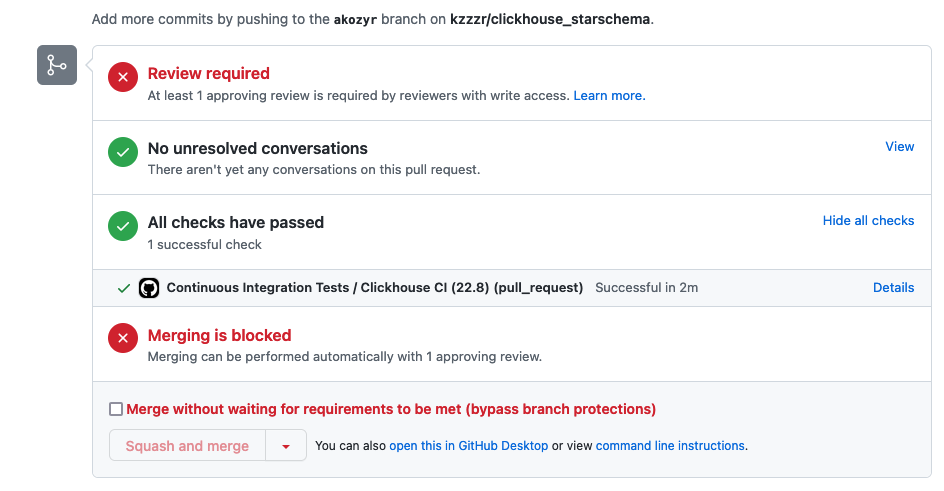

## 1. Configure Developer Environment
    
       devcontainer build .
       devcontainer open .

1. Populate `.env` file

    cp .env.template .env
    
## 2. Deploy Clickhouse

    yc init

1. Set environment variables:

    export YC_TOKEN=$(yc iam create-token)
    export YC_CLOUD_ID=$(yc config get cloud-id)
    export YC_FOLDER_ID=$(yc config get folder-id)
    export $(xargs <.env)
    

1. Deploy using Terraform

    cp terraformrc ~/.terraformrc
    
    terraform init
    terraform validate
    terraform fmt
    terraform plan
    terraform apply
   
    export CLICKHOUSE_HOST=$(terraform output -raw clickhouse_host_fqdn)
    export DBT_HOST=${CLICKHOUSE_HOST}
    export DBT_USER=${CLICKHOUSE_USER}
    export DBT_PASSWORD=${TF_VAR_clickhouse_password}

## 3. Check database connection

dbt debug

## 4. Deploy DWH

1. Install dbt packages

    
    dbt deps
  

1. Stage data sources with dbt macro

    
    dbt run-operation init_s3_sources
    

1. Build staging models:

   
    dbt build -s tag:staging

1. Prepare dynamic RFM table

    
     dbt build -s int_rfm --vars 'dt: 2023-01-01'
     dbt build -s int_rfm --vars 'dt: 2023-02-01'
     dbt build -s int_rfm --vars 'dt: 2023-03-01'
     dbt build -s int_rfm --vars 'dt: 2023-04-01'
     dbt build -s int_rfm --vars 'dt: 2023-05-01'
     dbt build -s int_rfm --vars 'dt: 2023-06-01'
     dbt build -s int_rfm --vars 'dt: 2023-07-01'
     dbt build -s int_rfm --vars 'dt: 2023-08-01'
     dbt build -s int_rfm --vars 'dt: 2023-09-01'
     dbt build -s int_rfm --vars 'dt: 2023-10-01'
     dbt build -s int_rfm --vars 'dt: 2023-11-01'

## 6. Create PR and make CI tests pass

## Shut down your cluster

terraform destroy
